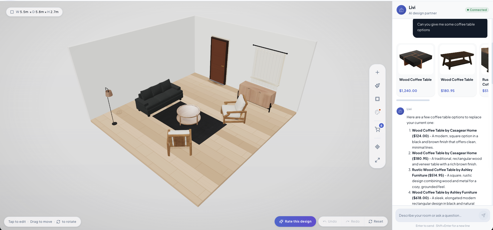
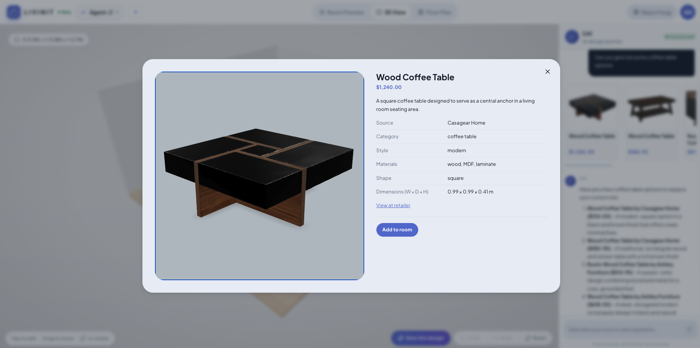
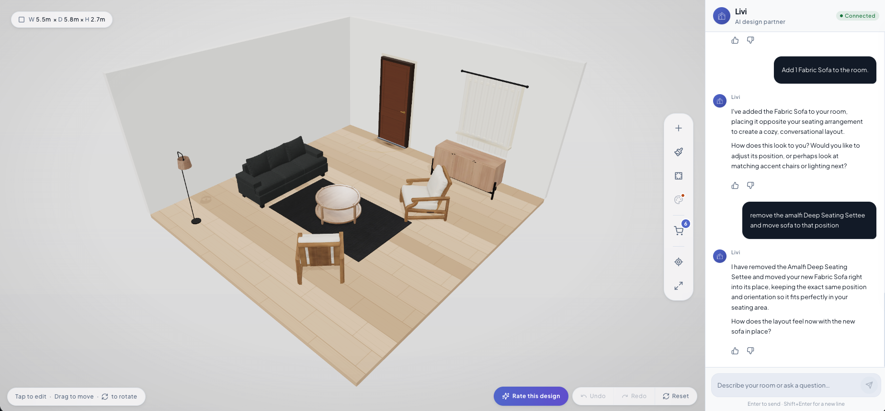

# Livi

**Complete and archived.** This research prototype successfully implemented a custom interior decorator agent built on the open-source PI core. The repository is retained as a reference.

Continued development has moved to the main private codebase for **Livinit**: [Open the product](https://web.livinit.ai/dashboard).

## What we achieved

- **Custom agent:** adapted PI's agent harness, session services, and transport for interior design conversations powered by Gemini.
- **Persistent chat:** streaming responses, cancellation, SQLite conversation history, reconnect, and interrupted-operation recovery.
- **Catalog discovery:** semantic product search, brand browsing, product details, recommendation cards, and follow-ups such as "show more," "cheaper," and "smaller."
- **Studio integration:** attach a conversation to a design, read room context and selection, and send edits to Studio for saving.
- **Room editing tools:** move, rotate, remove, add, replace, and duplicate objects; batch related edits and reverse supported saved changes.
- **Controlled execution:** design and revision checks, saved action history, and protection against replaying room edits with unknown outcomes.

## Agent tools

| Purpose | Tools |
| --- | --- |
| Read the room | `get_room_context` |
| Browse products | `search_catalog`, `list_catalog_brands`, `get_product_details` |
| Edit objects | `move_object`, `rotate_object`, `remove_object`, `add_object`, `replace_object`, `duplicate_object` |
| Group edits | `batch_room_edits` |

## Overall architecture

```text
                React chat
                    |
          PI WebSocket transport
                    |
               Node.js server
                    |
         Custom decorator agent <----> Gemini
            (PI AgentHarness)
                    |
        +-----------+-----------+
        |           |           |
     Sessions    Catalog      Studio broker
        |         tools         |
      SQLite        |       Connected Studio
   conversations PostgreSQL   room context
   + tool history + vectors   + saved edits
```

## Screenshots

Catalog recommendations alongside the connected room.



Product details with price, dimensions, materials, and an option to add to the room.



Room edits through chat: adding furniture, removing an object, and moving a sofa.



## Reference documentation

- [Architecture](docs/Architect.md)
- [Studio integration](docs/Studio-Contract.md)
- [Catalog search](docs/Catalog-Search.md)
- [PI provenance](docs/PI-Provenance.md)
